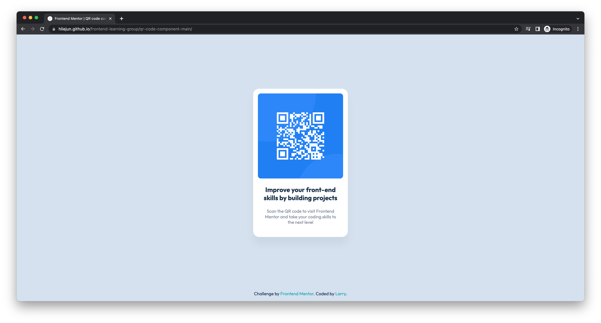
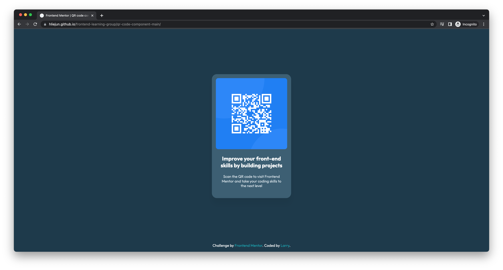

# Frontend Mentor - QR code component solution

This is a solution to the [QR code component challenge on Frontend Mentor](https://www.frontendmentor.io/challenges/qr-code-component-iux_sIO_H). Frontend Mentor challenges help you improve your coding skills by building realistic projects. 

## Table of contents

- [Overview](#overview)
  - [Screenshot](#screenshot)
  - [Links](#links)
- [My process](#my-process)
  - [Built with](#built-with)
  - [What I learned](#what-i-learned)
  - [Continued development](#continued-development)
  - [Useful resources](#useful-resources)
- [Author](#author)
- [Acknowledgments](#acknowledgments)

## Overview

### Screenshot

### Links

- Solution URL: [index.html](https://github.com/hliejun/frontend-learning-group/blob/main/qr-code-component-main/index.html)
- Live Site URL: [hliejun.github.io](https://hliejun.github.io/frontend-learning-group/qr-code-component-main/)

## My process

### Built with

- Semantic HTML5 markup
- CSS custom properties
- Flexbox

### What I learned

- Represent HTML elements with tags of correct/matching semantics
- Webfont FOUT
- CSS variables usage
- Alt text support and phrasing

### Continued development

- deal with [FOUT](https://medium.com/@fbnlsr/how-to-get-rid-of-the-flash-of-unstyled-content-d6b79bf5d75f)
- A11y

### Useful resources

- [Handling Safari border-radius transform transition](https://stackoverflow.com/questions/25891362/transition-on-transform-with-border-radius-and-overflow-hidden-doesnt-work-in-s)
- [Iterating through getElementsByClassName](https://stackoverflow.com/questions/15843581/how-to-correctly-iterate-through-getelementsbyclassname)
- [Dealing with flash of unstyled text (FOUT)](https://medium.com/@fbnlsr/how-to-get-rid-of-the-flash-of-unstyled-content-d6b79bf5d75f)
- [Naming convention for CSS classes](https://www.scaler.com/topics/css-class-naming-convention/)
- [CSS units usage and handling](https://www.sitepoint.com/understanding-and-using-rem-units-in-css/)
- [Webfont swap](https://css-tricks.com/google-fonts-and-font-display/#:~:text=To%20use%20font%2Ddisplay%20with,%3DOpen%2BSans%26display%3Dswap.)
- [Using CSS variables](https://developer.mozilla.org/en-US/docs/Web/CSS/Using_CSS_custom_properties)
- [Color palette generator](https://mybrandnewlogo.com/color-palette-generator)

## Author

- [Larry](https://hliejun.github.io)

## Acknowledgments

[Dave](https://davequah.com) for organising and guiding.